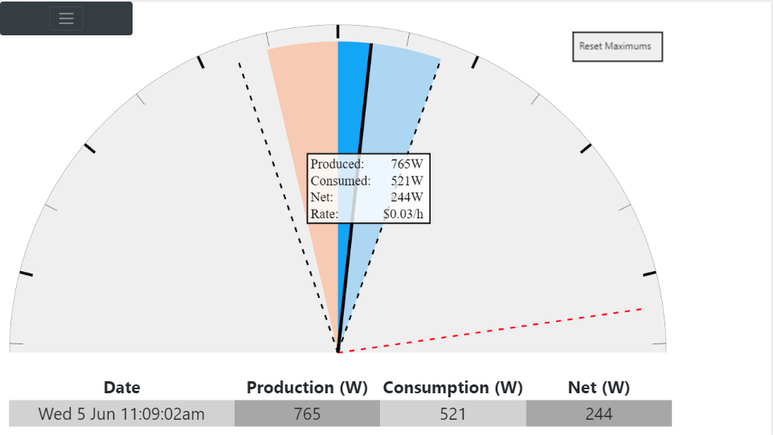
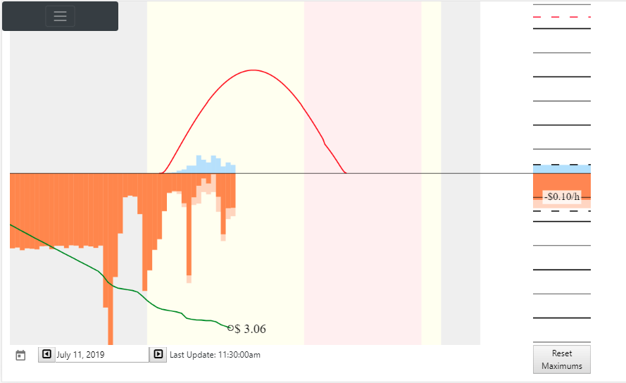
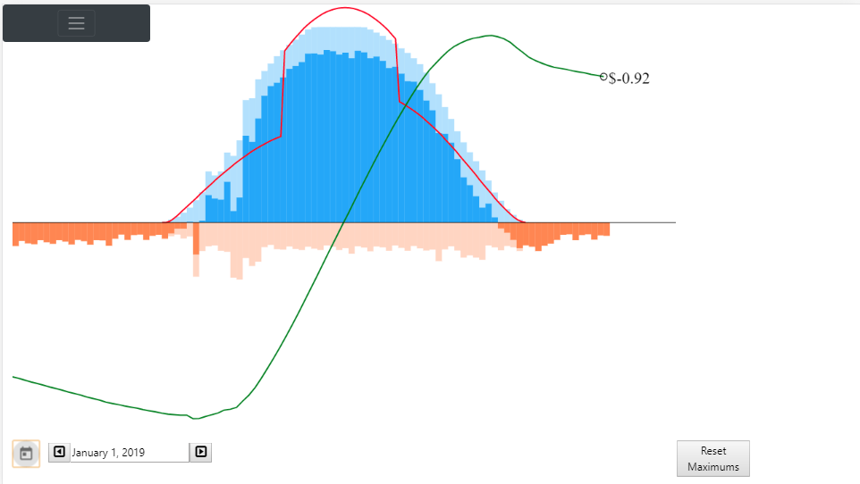
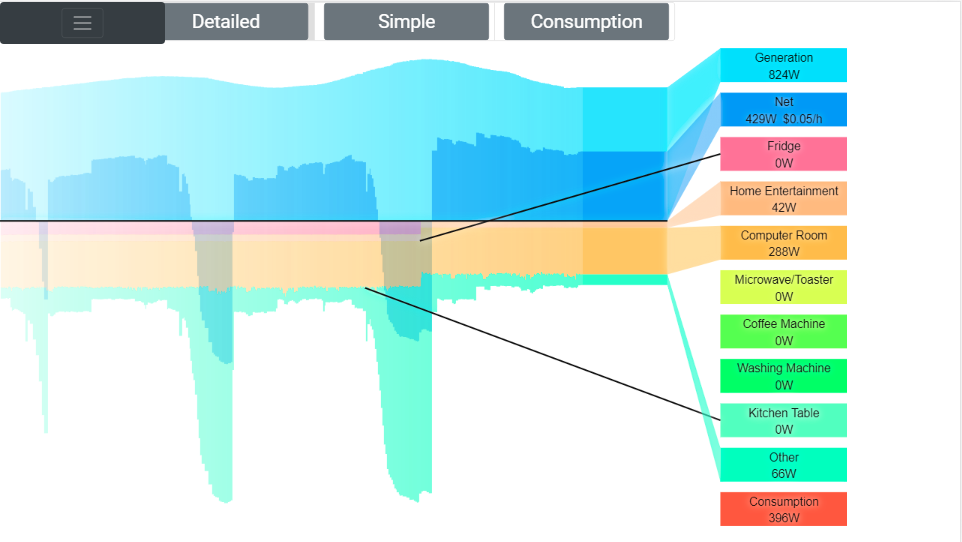
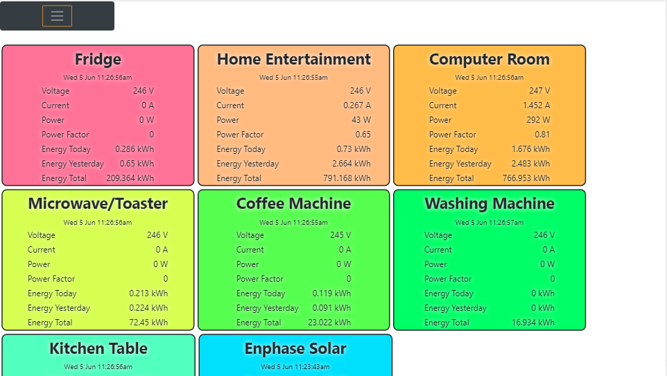
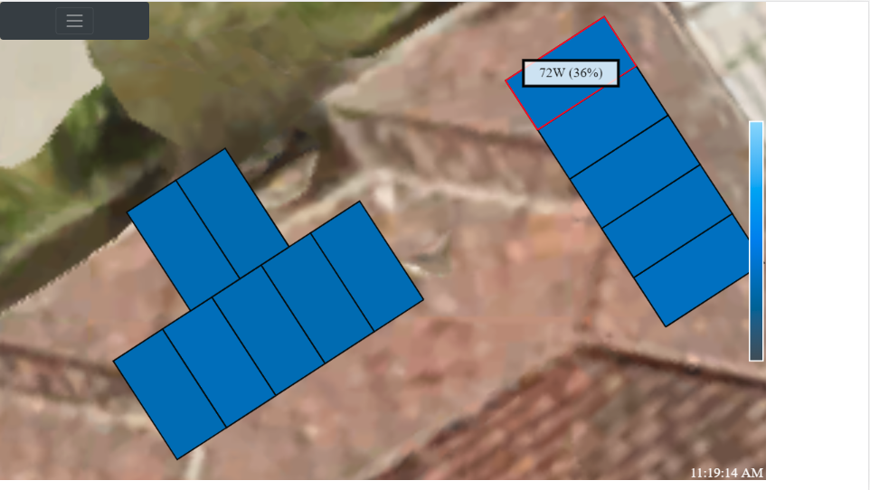

Home monitoring suite

## Envoy
  * Service to read Envoy panel level data every 5 minutes

## SonoffPowerMonitoring
  * Sonoff(MQTT) data collection service

## WebClient
  * Static html pages to view some envoy stats.
  * Also calculator to calculate power usage based on VEC data.

## EnvoyWeb
This is the main monitoring display of Envoy and Sonoff data.

The web application is used as a permanent display using a cheap android tablet.  It is written in Angular 7.0.  It is a work in progress - I'll make tweaks when I think of different information to show, or how to show it.

### Live Solar
This was originally the "home page" for the tablet.  This is shown below...

The display is like a car speedometer.  The light blue is the solar power being generated.  The light orange is the power being consumed.

If there is a surplus of power, this will be shown as a darker blue.  If there is a shortage of power (power taken from the grid), this will be shown as dark orange.  These match the colours used in the Enphase "Enlighten" application.

A dotted black line to the left shows the maximum consumption, and a dotted black line to the right shows the maximum production.  The dotted red line to the right shows the theoretical maximum production, 3.2kW for my system.

A pop up box shows the numerical values of the production, consumption and net power, as well as the instantaneous electricty rate for my electricity plan.

And the action shot...

### Solar History

This is my new "home page".  

The main chart shows the energy production and consumption during the day in 15 minute intervals (the colors are the same as the Live Solar page, matching the Enphase Enlighten app).  There aren't any units on the graph, but these are Wh/4, to remain consistent with the Enphase Enlighten  app.  The background colours represent the different time of day rates - grey is off-peak, yellow is shoulder, and pink is peak.

The red line shows the predicted maximum solar output.  This is determined from the calculated position of the sun, solar panel position and orientation and irradiance.  (See solar-history.component.ts)  This is an estimation; the line looks smooth on June 5 2019 (winter), but there is a step during summer...

This is because 5 panels point North East, and 7 point North West (I'm in the southern hemisphere).  I think the estimation is missing ambient light - even when panels aren't in direct sunlight, they still generate electricity.

The green line shows the electricty cost.  My electricy plan is a time-of-use plan, with a $1 per day "admin" fee.  The winter screen shot shows the electric storage hot water heater turning on overnight; this isn't shown in the summer chart because that part of the monitoring wasn't added until April.

On the right is a realtime power display; this is the same as the Live Solar display, except it is display as a bar.

And the action shot...

### Live Power

The live power page shows individual producers and consumers of electricity in real time.  This combines the Enphase production and consumption data with 7 Sonoff Pow R2 devices with the tasmota firmware and an MQTT mosquitto broker and client.

Production is shown above the line (just the solar), and consumption below.  Each sonoff device has its own colour.  Not every device has its own sonoff monitor; in the example above, the spikes in "other" are when I turned on the reverse cycle airconditioner.  "Other" is the difference between the Enphase measured consumption and the sum of sonoff devices.  I am only using sonoff devices dotted around the house, not a monitor at the switchboard.  I can't isolate air conditioning, lighting, hot water, and stove/oven.  That would require an electrician to replace my switchboard with a larger one, and install the monitor - too many $$$.

The buttons Detailed/Simple/Consumption show different sets of devices.  Each device label on the right can be clicked to go to the Devices screen.

And the action shot...

### Devices

The devices page shows individual producers and consumers of electricity.  This is the raw data from the sonoff devices, which includes consumption for today and the life of the device.  Clicking on a device shows the history, as shown in the Live Power video.

### Solar Panels

This display shows the solar panel layout and individual consumption of each panel.  This information is taken live from the Enphase micro-inverters every 5 minutes.  The solar output of each panel is shown in colour or by selecting a panel.

The panels aren't aligned very well over the google maps image of my roof in the screen capture.  The screen capture is from chrome simulating a tablet - the tablet looks better.

## Controllers

EnvoyController.cs and SonoffController.cs are REST APIs to access information.  This is either for database access (data is stored in MS SQL Server 2014), or for internet access (to overcome CORS issues).
